 
<h1>FIRST MINI PROJECT : 퀴즈왕 천부장</h1>

 

 

-------------------------------------------------------
<h3>● 계획 및 목표 </h3>

4월 15일, BITCAMP 학원에서 Java 교육과정을 끝마치고 첫번째 미니 프로젝트에 들어갔다. 각 팀별로 그동안 배운 내용을 토대로 원하는 프로그램을 만들어내는 것이다. 주제를 선정하고 주제 선정의 이유와 벤치마킹, 초기계획안을 발표하는 것이 첫번째 과제였다. 나는 8개 팀 중 1팀을 대표하는 팀장을 맡게되었다. 다른 팀원보다 자바를 다루는 것이 조금 더 익숙하다는 이유에서였다. 우리는 취업을 목표로 하는 만큼 실력을 쌓기 위해서 정말 배운것을 최대한 활용하여 프로그램을 짜길 원했다. 다행히도 팀원들도 같은 생각이였다. 따라서, java에서 배운 컬렉션(collection), TCP/IP통신, IO스트림 등등 최대한 사용해보기로 했다. 

우리팀은 1999년 부터 시작하여 2015년에 서비스를 종료한 '퀴즈퀴즈' 게임을 모티브로 OX퀴즈게임 프로그램을 만들기로 계획했다.
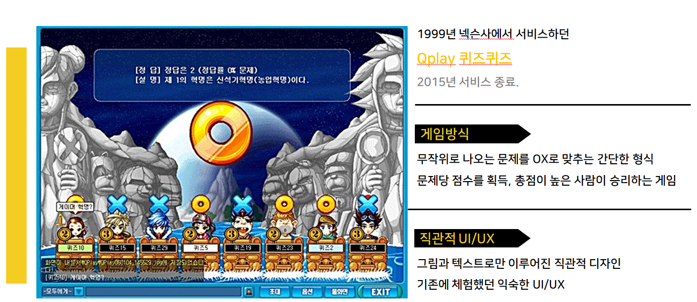  
어떻게 시작해야 할지 너무나 막막했지만, 팀원들과 천천히 머리를 맞대고 생각해보았다. 가장 기본적인 틀은 4명의 클라이언트가 접속하여 문제를 푸는 방식이였다.  그때 팀원 중 게임의 전체적인 디자인을 맡은 친구가 '트위치(twitch)' , '아프리카TV(AfreecaTV)' 플랫폼의 채팅 디자인을 가져와 문제를 풀지 않는 사람들도 채팅으로 참여 할 수 있는게 어떻겠냐는 의견을 제시했다. '퀴즈퀴즈' 온라인 게임을 모티브로 한 만큼 완성 되었을 때 , 학원 같은 반 친구들 모두가 참여 할 수 있는 그런 게임을 만드는 것. 정말 좋은 아이디어였다. 또 다른 팀원도 그의 의견에 동의하여 진행 하기로 했다.  
모든 팀원이 코드작성에 기여하기 위해서, 또한 모든 팀원이 코드작성을 통해 배운 개념과 원리등을 복습하도록 하기 위해서 일정 진도를 정해서, 각자 짜보기로 했다. 따라서 나는 채팅서버와 게임서버를 분리하여, 채팅서버에 접속한 인원이 게임안에 있는 '참여하기' 혹은 'join' 버튼을 누르면 4명의 클라이언트가 게임서버로 접속하여 게임이 시작되는 방식으로 프로그래밍 하려고 계획했다.   
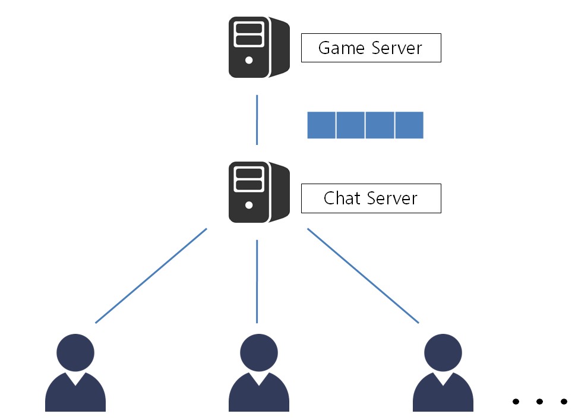 

--------------------------------------------------
<h3>● 문 제 점 </h3>

<html>
<link  rel="stylesheet" href="style.css">

  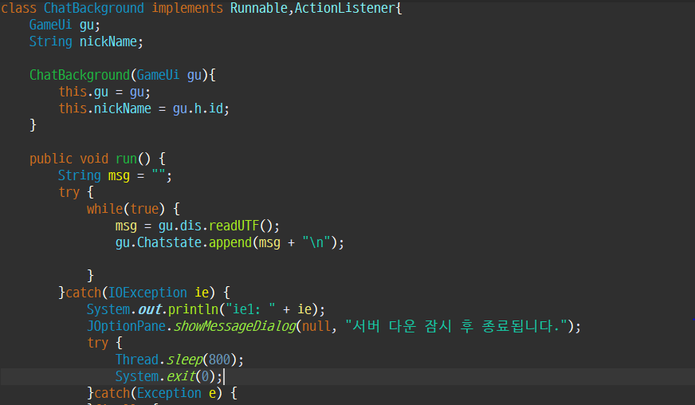

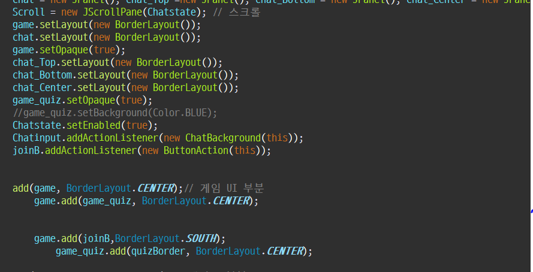

</html>

 

학원에서 배운 UI 도구는 Java.swing 이였는데 아무래도 사용법이 익숙치 않아서 Ui 구성하는 부분에서 어려운점이 많았다. Enter키를 눌렀을때 채팅 UI로 나타나게 하는 명령어를 KeyListener를 사용할지, ActionListener를 이용할지에 대한 고민과 그 해당 Listener를 통한 다중채팅구현에서도 어려움이 많았다. 그래도 UI를 하나씩 구축해 나가면서 큰 틀을 만들어갔다. 첫번째 단계에서 textfield를 이용하여 입력받은 값을 ChatServer에 연결시키고 1:1 통신을 성공하며 여러 문제점들을 한 단계씩 해결해 나가면서 다중채팅까지 java.swing을 이용해 GUI 로 구현해내는데 성공했다. 밑의 그림처럼 여러 유저가 서버IP, PORT번호, 채팅에 접속해서 사용할 아이디를 입력하여 채팅서버에 접속한다. 그 후 3명의 클라이언트가 통신하여 채팅하는 모습을 볼 수 있다.

<html>
<link  rel="stylesheet" href="style.css">

  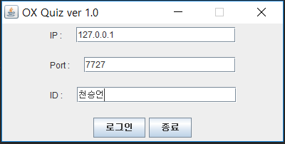

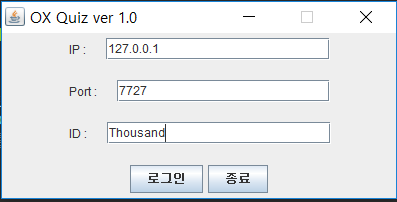

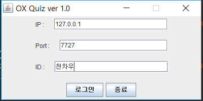
</html>
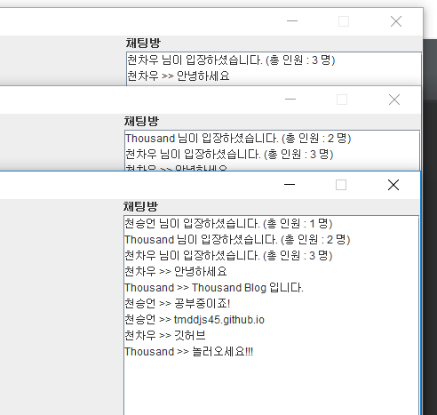 

어찌 되었든 간에 TCP/IP를 이용한 멀티채팅은 구현하는데 성공했지만, 문제점은 게임서버입장이였다. 사실 입장시키는것 자체만으로는 채팅을 접속한것처럼 Seversocket만 연결해주면 간단한 문제였지만, 4명의 클라이언트로 제한한다는 점과 그 4명의 클라이언트들이 들어왔을 때, 각 UI에 배치되는 로직, 또한 그 클라이언트들과 서버간에 통신 사이에서 데이터를 어떻게 구분짓고 처리하는지에 대한 로직에 부딪히고 말았다.

 

<b>해결책</b>은 프로토콜(Protocol)을 이용하는 것이다. dos.writeUTF() 메소드를 사용 할 때 , 구분하고 싶은 데이터 부분 앞에 # 또는 @ 등을 추가적으로 넣어주어 받아주는 dis.readUTF() 메소드에서 subString 으로 걸러내어 데이터를 구분하면 위에 문제점을 해결 할 수 있었다. 그러나 *<u>프로젝트에는 기간이 있었기 때문에 기간 안에 완성시키기 위해서는 어쩔수 없이 Network를 통한 게임보다는 Local로 할 수 있는 게임으로 방향을 바꾸어 코드를 짰다.</u>*

---------------------------------------
<h3>● 결 과 </h3>
<html>
  

    
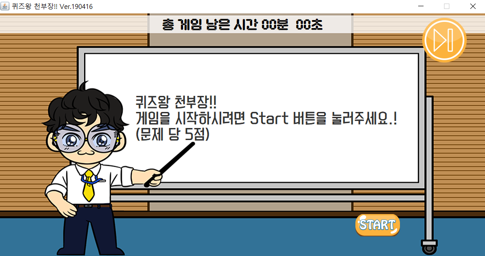

    
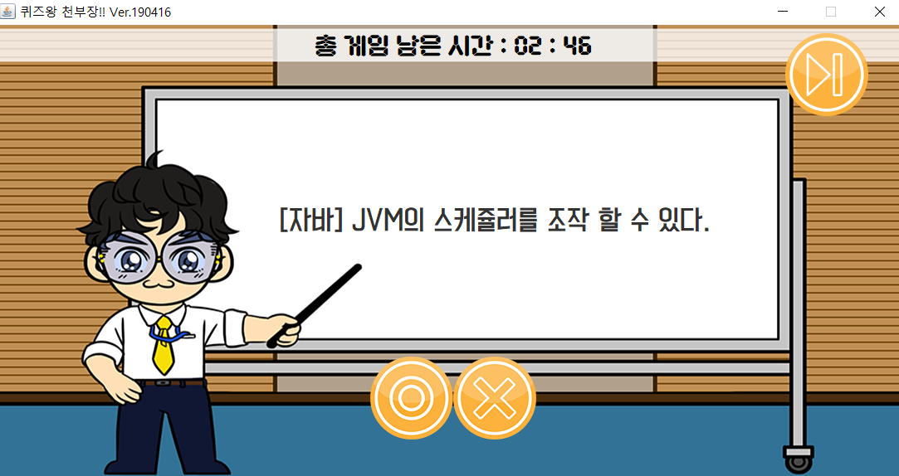

  

</html>
 
위 그림은 게임화면이다. 좌측사진 우측하단 밑에 Start 버튼을 누르게되면 Start버튼은 setVisible(false)로 비활성화 시키고 O,X 버튼을 setVisible(true)로 활성화 시킨다. 게임이 시작되면서 화이트보드에 text파일로 저장되어있는 문제들을 FileInputStream, BufferedReader등 IO객체들을 이용하여, 데이터를 읽어 와 뿌려준다. 이런 데이터들을 보내고 받는 과정에서 문제점에서 얻은 힌트인 '프로토콜(Protocol)'을 사용하여 문제데이터와, 정답데이터를 분리 할 수 있었다. 
<html>
  

    
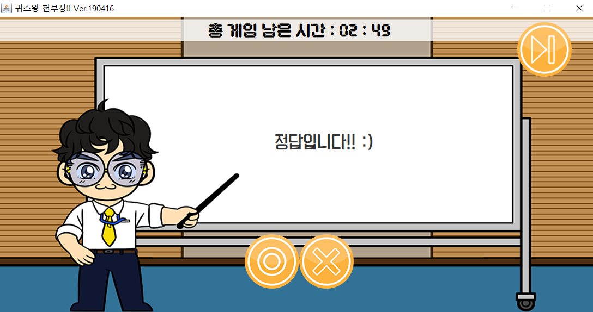

    
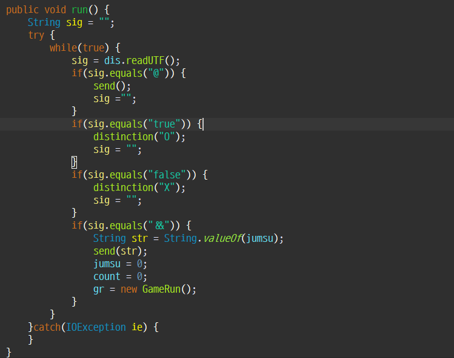

  

</html>
그 결과, 답을 맞추면 점수를 count+=5; 하여 5점씩 증가시키고 시간초가 다 끝나면, 총 점수가 나오게 했다. 게임은 잘 실행이 되고 앞에서 말하지 못한 문제점들도 여러가지 있었다. 다중 Thread를 이용하여 프로그램을 구성하고, 시간초를 적용시켜 게임을 끝내는 방식을 로직을 짤 때도 문제가 있었다. 그래도 <u>검색과 질문을 통해 방법을 끝끝내 찾아가며 Local Game을 구현하는데 성공했다.</u>

----------------
<h3>● 느 낀 점 </h3>
이번 프로젝트를 진행하면서 정말 많은것들을 느꼈다. 그 중에 가장 대표적인것들 몇가지를 말하자면 **첫번째**는 '프로그램 설계를 조금 더 구체적으로 하자'이다. 가장 중요한 것 같다. 주어진 기간내에 결과물을 만들어 내야하는 만큼 구현가능한 프로그램을 구상하고 어떻게 구현할지 설계를 한 다음 코드작성에 들어가야 한다. 뿐만 아니라 유저(User) 및 클라이언트(Client)가 어떻게, 왜 사용할 지 UI/UX적인 부분도 전부 설계를 하고 코드작성을 시작해야한다. 그 후 코드 작성을 하고 시간이 허락한다면 그때 부가적인 기능들을 추가해야한다. 우리는 끝까지 프로젝트 시간이 부족하여 완벽한 디버깅(debugging)을 하지 못했다. 이번 경험을 통해 코드작성, 로직구현만 중요한게 아니라 전체적인 틀을 잡는 '설계'가 중요하다는 것을 느꼈다. 즉, PM 역할의 중요성이였다. **두번째**는 팀워크(TeamWork)이다. '퀴즈왕 천부장'을 진행하면서 팀원들 간에 팀워크는 사실 엄청 좋았다고 생각한다. 그 덕분에 완성 할 수 있었다. 만약 좋지 않았더라면 끝끝내 완성 할 수 없었을 것이다. **세번째**는 커뮤니케이션이다. 즉, 대화이다. 서로 의견들을 존중하여 조율하고 그런 과정을 통해 오류도 잡아가며 하나씩 더 배워 나갈 수 있었다. 내가 모르고 있는 것을 상대방이 알수도 있고 내가 아는것을 상대방은 모를수 있다. 서로 대화를 통해 부족한점을 채워나가고 누군가에게 배워가며 혹은 누군가를 가르치며 발전해 나가는 그런 모습들이 이번 프로젝트를 진행하면서 많이 비춰졌다. 우리팀의 프로젝트에 대한 객관적인 평가는 어떨지 모르겠다. 완성도가 낮다고 비판을 할 수도 있다. 하지만 나는 이번 프로젝트를 통해 얻어가는 것은 다른 팀에 못지않다고 자부 할 수 있다. 코드와 로직 측면에서는 기본기가 더 탄탄한고 견고해졌다. 개발자가 되면서 기술적인 측면 로직구현, 코드작성이 중요하다. 그것은 부정할 수 없는 사실이다. 하지만 규모가 큰 개발은 혼자 하는 것이 아니다. 회사에 취업해서도 개발은 혼자 하지 않는다. 이러한 사실도 부정할 수 없다. 따라서 이번 프로젝트를 통해 나는 엄청난 것을 배운게 아닐까라고 생각한다. '개발'자 로서가 아닌 개발'자'로서 많이 배운것 같다.
