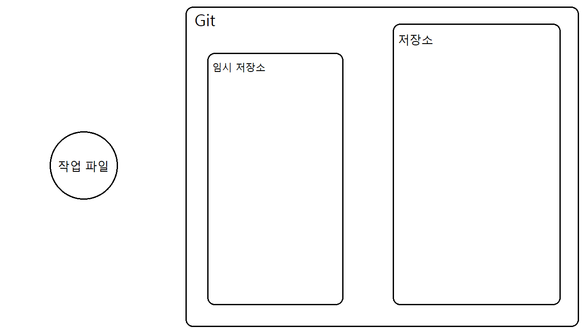
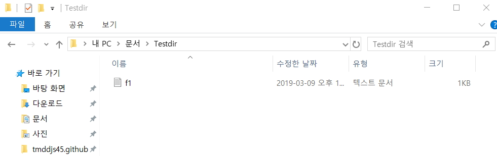
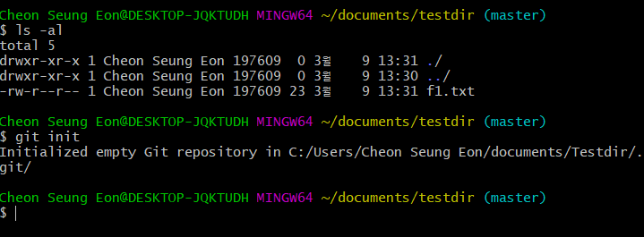
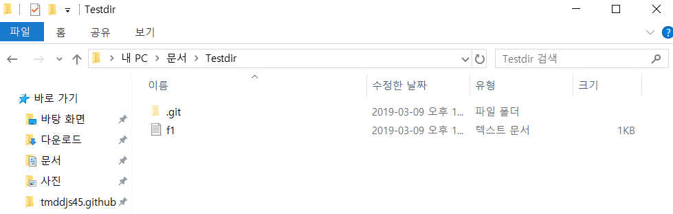
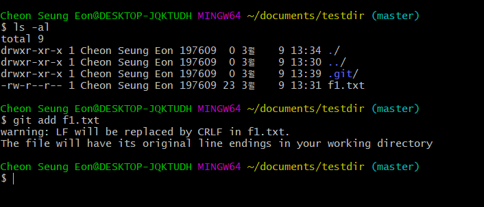
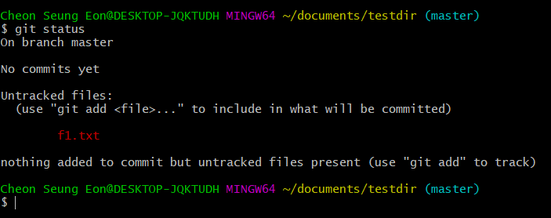
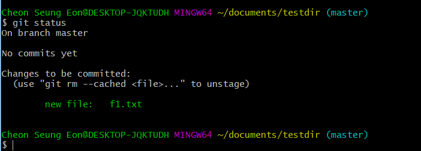
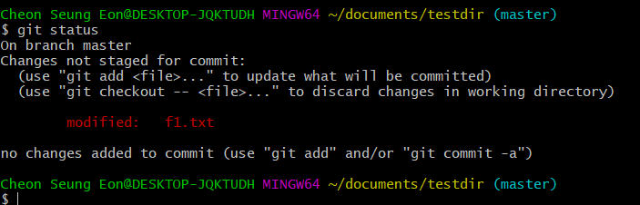
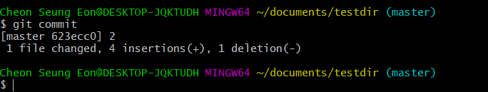
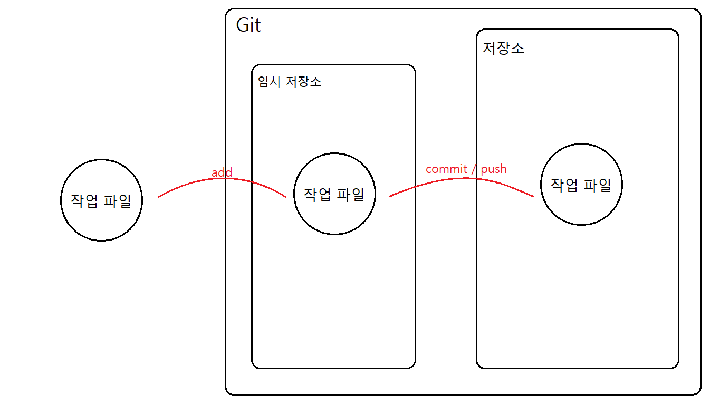

<h3>글을 시작하기 앞서..</h3>
이전 글에서는 기본적인 개념을 설명했을 때 단순히 덮어쓰기로 예를 들었다. 이번 글은 그 덮어쓰기 과정을 알아보기위해 작성하는 글이다. 어떤 절차를 거쳐 과연 버전관리가 되는지, 간단한 명령어들과 함께 알아보기로 하자.

---

<h2>Git의 기본원리 및 과정</h2>
  우리가 단순히 Git을 설치만 한다고 해서 원하는 파일이 자동으로 버전관리가 되는것이 아니다. 그럼 어떻게 해야지 Git이 우리가 원하는 파일의 버전을 관리해주는 것일까?   
Git의 존재는 버전관리시스템(Version Control System)이지만, 간단히 생각하면 파일내용의 history를 저장하는 커다란 저장소인데 Git을 처음 접하는 입장에서는 머릿속에서 잘 그려지지 않는다. 부족하지만 나름 생각을 정리해서 Git의 구조를 그려보자면 밑에 그림과 같을 것이라고 상상한다.

 

그렇다면 우리가 버전을 관리하기 위해서 무엇을 어떻게 시작해야 하는 것일까? 실습사진을 통해 천천히 하나씩 알아가보자.

 
Testdir 이라는 디렉토리에 버전관리를 애타게 기다리고 있는 f1.txt 파일이 있다. 먼저 버전관리를 하기 위해서는 Git 저장소를 생성해야하는데, 다음 명령어로 우리는 Git 저장소를 생성해준다.
<pre><code>$ git init</code></pre>
 

init은 사실 initialization(초기화)를 뜻하며, 현재 디렉토리를 Git저장소로 초기화 해준다는 개념이다. 머릿속에 잘 그려지지 않는다면 그냥 저장소를 생성한다라고 이해해도 괜찮을것 같다. 명령어를 입력해서 잘 동작 되었다면 밑에 보는 그림과 같이 f1.txt만 존재하던 Testdir 디렉토리에 .git 라는 새로운 디렉토리가 생긴것을 볼 수있다. 저것이 바로 버전관리에 가장 중요하고 필요한 Git저장소이다. 위에 봤던 상상도의 Git인것이다.  
 
명령어를 통해 Git저장소를 생성(초기화)했다면 버전관리에 있어서 준비는 끝난것이다. 그렇다면 우리는 이제 Git에게 "Git아 내가 원하는 작업파일을 버전관리 해 줘!  f1.txt 파일을 버전관리 해 줘!" 라며 요청해야한다.

<pre><code>$ git add f1.txt</code></pre>
 

git add [버전관리 할 파일명] 명령어를 사용 해 상상도에서 봤던 Git임시저장소에 파일을 업로드한다고 생각하면 이해가 쉬울 것이다. 여기서 말하는 임시저장소는 물리적으로 실제하는 저장소가 아니라는것을 알아둬야한다. 이해를 돕기 위한 예시인것이다. 자세히 들어간다면 SHA-1이라는 특정 Hash 알고리즘을 이용한것인데, 자세한 내용은 다음 글에서 다룰 예정이다.  
add 명령어를 입력하여 임시저장소에 올렸다면 Git은 이제 버전관리를 하기 바로 직전인 '버전관리 대기상태'로 진입 한 것이다. Git의 상태를 보기위해서는 status명령어를 사용하는데, Git이 지금 대기상태인지 아닌지, 버전관리하는 파일에 대한 수정 사항이 있는지 없는지를 파악해준다.

<pre><code>$ git status</code></pre>

>>Untracked , 즉 추적하고있지 않는 상태, 어떤 대기상태도 아닌 것을 보여준다. / add전

>>New file: f1.txt , commit 명령어를 기다리는 대기상태. / add후

>>modified: f1.txt , 버전관리 되고있는 f1.txt파일이 변경되었다는 표시. / add전

 이렇게 임시저장소에 올리는, 즉 대기상태로 만들어 놓았다면 우리는 이제 Git이 버전을 만들어 실질적으로 관리 할 수있게 명령 해줘야한다. 바로 commit이라는 명령어다.

<pre><code>$ git commit</code></pre>
 

이 명령어를 통해 임시저장소에 있던 파일을 실질적인 Git저장소에 commit을 해서 직접적으로 Git이라는 버전관리시스템(Version Control System)이 버전관리에 돌입하게 되는 것이다. 결과적으로 밑에 보는 그림과 같은 과정일 것이다.
 
<pre><code>$ git log</code></pre>

위에 log 명령어로 Git이 어떤 버전을 관리하고 있는지 기록을 볼 수 있으니, 정상적으로 관리가 시작되었다면 위 명령어로 확인 할 수 있을 것이다.  

---

<h3>글을 마치며..</h3>
이렇게 이미지와 간단한 설명을 통해 Git으로 버전관리를 시작하기까지의 과정을 알아보았다. 처음 내가 생각했던 것과 다른 글이 되어 버렸다. 만족스럽지 않는 글이다. 사실 전문가 처럼 Git의 원리를 멋지게 설명해 Git의 유용성, 필요성을 강조하려고 했지만, 기본원리라고 하기에도 창피할 정도로 그냥 실습과정만 나열한것 같다. 아직 너무 부족하다. 몇 번이나 글을 썼다 지웠다 한지 모른다. 아직 Git에 대한 이해도가 부족하고 두루뭉실한 상태로 설명하려다 보니 만족스럽지 못한 결과물이 나온것이다. 채워 나가야 할 점이 많다. 그래도 이 글을 여러번 수정하고 수정하면서 생각했다. '정확한 Git의 원리를 전달하지 못하더라도, 실습 과정 등을 통해 Git에 대해 잘 모르는 독자, 나처럼 혼자 공부하는 독자가 접했을 때 같이 따라하면서 조금이나마 도움이 될 수 있는 글을 작성하자'라고.  

**조금이라도 도움이 되면 좋겠다.**

다음 글을 쓸 때는 공부를 좀 더 열심히 해서 설명해보자.

---

<h3>Reference</h3>
<ul>
  <li>생활코딩 [지옥에서 온 Git] : <a href="https://opentutorials.org/course/2708">https://opentutorials.org/course/2708</a></li>
  <li>Git-scm : <a href="https://git-scm.com/">https://git-scm.com/</a></li>
